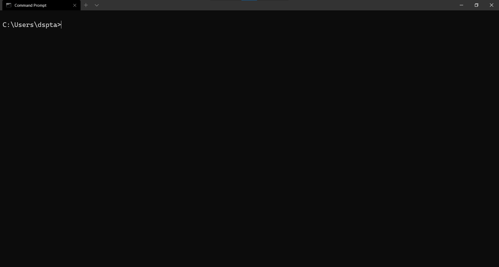
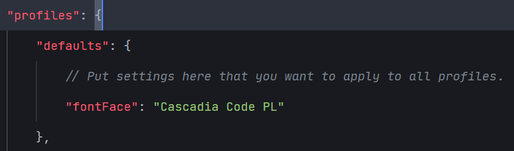
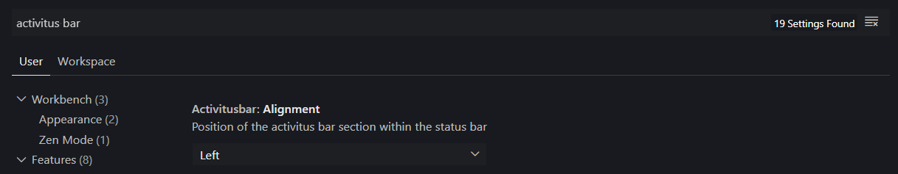
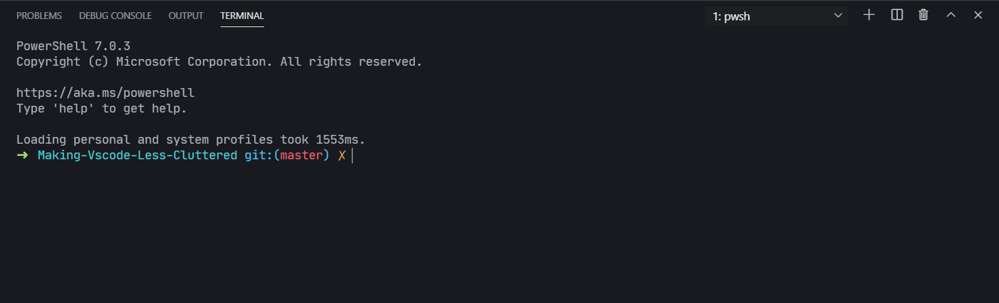
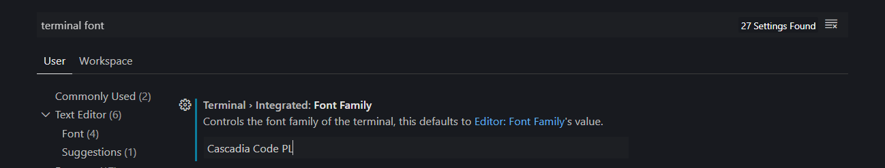
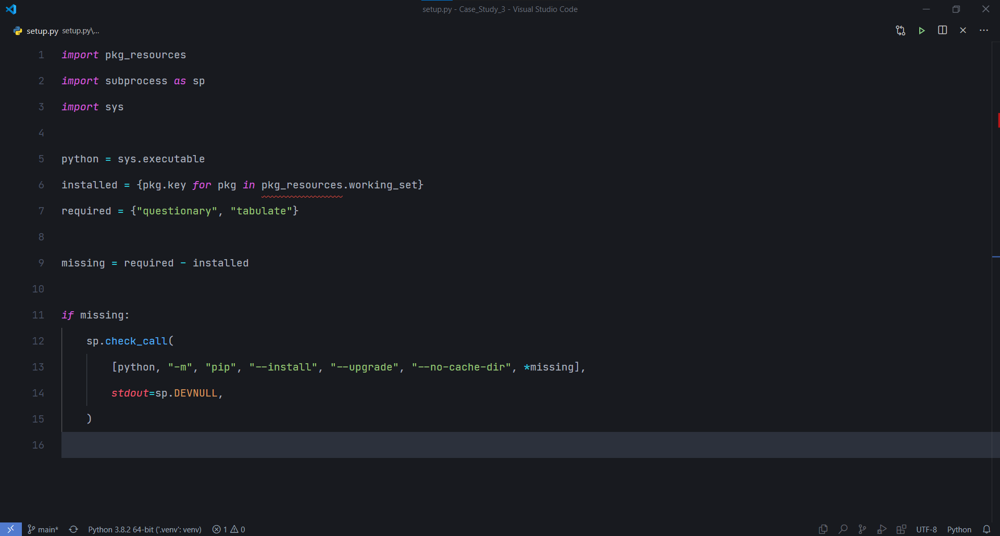

# Making VSCode Cleaner (Windows Only)

VSCode is one of the most popular editors out on the market right now. It was developed by Microsoft and now is being used by millions of users.

Although it is a fantastic editor, at times I felt like it is a bit cluttered and not very pleasant to look at.

I made this guide so that others who feel like me can make their VScode setup less cluttered.


List of extensions used in this guide:

- [Activitus Bar](https://marketplace.visualstudio.com/items?itemName=Gruntfuggly.activitusbar)
- [One Dark Darker](https://marketplace.visualstudio.com/items?itemName=JoelCrosby.one-dark-darker)

Fonts used:
- [JetBrains Mono](https://www.jetbrains.com/lp/mono/)
- [Cascadia Code PL](https://github.com/microsoft/cascadia-code)

Apps Used:
- [Powershell Core](https://github.com/PowerShell/PowerShell)
- [Windows Terminal]()

Pre-Requisites:

- Git installed
- Powershell Core Installed
- VSCode installed
- Windows Terminal Installed

----
## Section 1: Setting up Windows Terminal

Windows Terminal is a brand new App by Microsoft which allows us to have multiple command lines open in a single window in a tab-like format. A good example would be to compare the individual command lines to browser tabs, and Windows Terminal being the browser which can hold all of them together.

Once you have downloaded the setup file for your device, run it to install it. After it is installed, open the App and you should be greeted with a screen like this:



----

## Section 2: Setting up Powershell

Powershell Core is a command-line shell which has additional functionality as well.

Open Powershell Core in Windows Terminal (You can open Powershell in Windows Terminal using the dropdown menu at the top) 

After it is opened, install [Posh-Git](https://github.com/dahlbyk/posh-git), [Oh-My-Posh](https://github.com/JanDeDobbeleer/oh-my-posh) and [PS Readline]():

- Posh-git Command: 
    - ```Install-Module posh-git -Scope CurrentUser```

- Oh-My-Posh Command:  
    - ```Install-Module oh-my-posh -Scope CurrentUser```

- PSReadline Command: 
    - ```Install-Module -Name PSReadLine -Scope CurrentUser -Force -SkipPublisherCheck```

### Changing the Theme: 

The modules we just installed allow us to change the look of PowerShell and make it look more suitable for developers

Run ```notepad $PROFILE```. This will open the PowerShell Settings file in NotePad. Now, add these lines to the end of the file (Or at the start, if the file is empty)

- ```Import-Module posh-git```
- ```Import-Module oh-my-posh```
- ```Set-Theme robbyrussell```

Once you have done so, save the file and close it. Now, close all instances of Powershell .

Open it once again and you should see a window like this:


If you do not see the arrow, don't worry! That is happening because we have not installed the correct font yet.

Go ahead and download Cascadia Code from the link mentioned above. Now, extract the .zip file to a folder and then install "Cascadia Code PL". The "PL" stands for PowerLine which means that it has the necessary characters for us to use.

Now, to set Cascadia Code PL as the default font in Windows Terminal, we have to change the settings. Use the shortcut ```Ctrl+,``` to open the settings.json file or open it from the dropdown menu.

Once it has opened, insert the following line into the ```defaults``` section:
- ```"fontFace":"Cascadia Code PL"``` 

Your defaults section should look like this:



Be sure to save the file. As soon as the file is saved, you should see the arrow appear in your PowerShell Tab.

Now we have a professional looking command line!

----

## Section 3: Removing the unnecessary stuff from VSCode

Now onto the important stuff: Fixing VSCode.

Here is a list of all the stuff that we will be modifying:
1. The file tabs(Optional)
2. The Activity Bar
3. The Menu Bar
4. Cleaning up the Status Bar
5. Removing the Status Bar (optional)
6. Removing the Mini-Map

### **Part 1:** Removing the file tabs:

We can remove file tabs in 2 ways:
- From the **Command Palette**:
    - Open the Command Palette and search for "Tab Visibility". 
    - Find the option that says "View:Toggle Tab Visibility"
    - Click on that. Now the tabs are gone! 
    - This immmediately makes the top part of VSCode Less cluttered.

- From **Settings(JSON)**:
    - Open Settings JSON using the Command Palette and insert the following line in the file:
        - ```"workbench.editor.showTabs":false"```


### **Part 2:** Removing the Menu Bar:

This one is pretty straightforward.

To disable the Menus on the top left of VSCode, simply search for "Menu Bar" in the Command Palette.

Find the option that says "View: Toggle Menu Bar".

Click on that and you should see the menu bar disappearing.

To access it any time, simply press Alt and it will be visible again 

### Part 3: Removing the Activity Bar and moving the SideBar:

This one requires some extra work, as we still wish to access the different panels accessible by the Activity Bar.

To get started, install the extension **Activitus Bar** mentioned above. When it is installed, you should see 5 icons appear on the status bar (the bottom bar of VSCode).

----
Now, you can move the icons and the sidebar to the right side or let them stay at the left side. If you wish to move them to the right side, follow these steps:

----

- Open the Settings(UI) [Ctrl+,]
- Search for "Activitus Bar" 


- Change the alignment option to "Right"
- The icons will now shift to the Right.
- To open/close any panel, simply click on the icon corresponding to the panel.
- For example, to open the Explorer, click on the first icon (Files)

----
- To move the Side Bar to the Right Side, open the Command Palette and search for "Side Bar"
- Find the option that says "View: Toggle Side Bar Position"
- Click on that and you will see that the side bar has now moved to the right side!

----

Now to remove the activity bar, we once again have to open the Command Palette.

Search for "Activity Bar" and then click on the option which says "View: Toggle Activity Bar Visibility"


Now that the Activity Bar is gone, our setup looks much cleaner!

### **Part 4**: Cleaning up the Status Bar:

The Status Bar in its raw form contains a lot of non-useful items which make it seem very cluttered.

In order to fix that, we are simply going to disable some of those items!

To disable items from the status bar, simply right click on the status bar and choose the items that you don't want to have in there.

These are the items that I have disabled. You are free to disable whichever items you want.

- Editor Selection
- Editor Indentation
- Editor End of Line
- Tweet Feedback


### Part 5: Removing the Status Bar

**NOTE** : I DO NOT RECOMMEND doing this unless you feel that there is nothing in the Status Bar which is of use to you.

If you feel that you know keyboard shortcuts well enough to navigate using them daily, then the step to disable the status bar is as follows:
- In the Command Palette , search for "Status Bar".
- Click on the option that says "View: Toggle Status Bar Visibility"

There you go! You have successfully made your VSCode setup much more minimal and cleaner.

### Part 6: Removing the Mini-Map

The Mini Map is a small Map that appears on the right side of the editor. Although useful, it takes up too much space - space that can be useful for us.

To remove the Mini-Map, open the Command Palette and Search for "Minimap"

Find the option that says "View: Toggle MiniMap"

Now, the MinMap should be disabled.

---- 
## Section 4: Spicing up things

So far, we have modified the actual VSCode Window. But, we have done nothing to modify the editor or the terminal.

### Part 1-Modifying the Editor:

In accordance with our aim of getting a minimal editor, these are the steps to make the actual editing area much more easy to look at:

- Open Settings(JSON)
- Add the following lines to the end:
    - ```"editor.fontFamily": "JetBrains Mono",```
    - ```"editor.fontSize": 16,```
    - ```"editor.lineHeight": 40,```
    - ```"editor.suggestLineHeight": 40,```

- Save the Settings.json file and close it. 
- You will see that the editor immediately looks much better and much more readable.

----
*What are Font Ligatures?*

Font Ligatures are a specific way of showing fonts wherein two specific characters are show as one character. To learn more about font Ligatures, visit this [Link](https://www.hanselman.com/blog/MonospacedProgrammingFontsWithLigatures.aspx)

----

Steps to enable font Ligatures in VSCode:
- Open Settings(JSON) once again and add the following line to it:
    - ```"editor.fontLigatures":true,```

### Part 2-Modifying the Terminal:

We have already setup Powershell to be a developer's terminal.

To ensure that VSCode uses PowerShell Core , we need to specify the default shell.

Fortunately, that is pretty easy to do. The steps to do so are as follows:
- Open Terminal using ```"Ctrl+`"``` or drag it out from the bottom of VSCode.

- Once it has opened, change the default shell by opening the dropdown menu on the top right side and selecting "Select Default Shell". Now, select "Powershell". The location should be something like ```C:\Program Files\PowerShell\7\pwsh.exe```

- Now, close the current shell by clicking on the bin icon on the top part of the shell. Once you reopen it, you will see that it shows the modified shell i.e. PowerShell Core.


If you do not see some characters or you see squares, don't worry! We can fix that by changing the terminal font to Cascadia Code PL. To change the Terminal Font, open Settings(UI) and search for Terminal Font.



Change it to Cascadia Code PL and hit save. Now, all characters should be displayed properly within the terminal window.


### Part 3-Choosing a Good Theme:

A good theme is important not only to your worflow, but also to your eyes. If we do not choose a good theme, chances are that you may feel disinclined to code.

That being said, every person has his/her own choice of themes. So, go ahead and search for "themes" the VSCode MarketPlace and choose the one that you like the most.

A few good themes I have used are:
- Monokai (In-Built)
- [One Dark Pro](https://marketplace.visualstudio.com/items?itemName=zhuangtongfa.Material-theme) (Extension)
- [One Dark Darker](https://marketplace.visualstudio.com/items?itemName=JoelCrosby.one-dark-darker) (Port of One Dark Pro; slightly darker background)
- [Github Theme](https://marketplace.visualstudio.com/items?itemName=GitHub.github-vscode-theme) (Extension)


And that is it! Now we have successfully made your Powershell professional and VSCode more minimal.

This is how our final setup looks :



Happy Coding!
