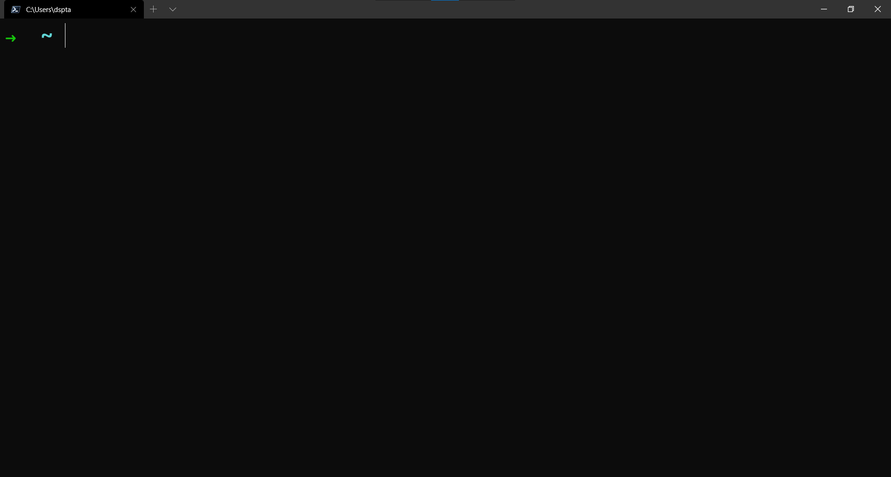

# Making VSCode Less Cluttered

VSCode is one of the most popular editors out on the market right now. It was developed by Microsoft and now is being used by millions of users.

Although it is a fantastic editor, at times I felt like it is a bit cluttered and not very pleasant to look at.

I made this guide so that others who feel like me can make their VScode setup less cluttered.


List of extensions used in this guide:

- [Activitus Bar](https://marketplace.visualstudio.com/items?itemName=Gruntfuggly.activitusbar)
- [One Dark Darker](https://marketplace.visualstudio.com/items?itemName=JoelCrosby.one-dark-darker)

Fonts used:
- [JetBrains Mono](https://www.jetbrains.com/lp/mono/)
- [Cascadia Code PL](https://github.com/microsoft/cascadia-code)

Apps Used:
- [Powershell Core](https://github.com/PowerShell/PowerShell)
- [Windows Terminal]()

Pre-Requisites:

- Git
- Powershell Core Installed
- VSCode installed
- Windows Terminal Installed

## Section 1: Setting up Windows Terminal

Windows Terminal is a brand new App by Microsoft which allows us to have multiple command lines open in a single window in a tab-like format. A good example would be to compare the individual command lines to browser tabs, and Windows Terminal being the browser which can hold all of them together.

Once you have downloaded the setup file for your device, run it to install it. After it is installed, open the App and you should be greeted with a screen like this:


## Section 2: Setting up Powershell

Powershell Core is a command-line shell which has additional functionality as well.

Open Powershell Core in Windows Terminal (You can open Powershell in Windows Terminal using the dropdown menu at the top) 

After it is opened, install [Posh-Git](https://github.com/dahlbyk/posh-git), [Oh-My-Posh](https://github.com/JanDeDobbeleer/oh-my-posh) and [PS Readline]():

- Posh-git Command: 
    - ```Install-Module posh-git -Scope CurrentUser```

- Oh-My-Posh Command:  
    - ```Install-Module oh-my-posh -Scope CurrentUser```

- PSReadline Command: 
    - ```Install-Module -Name PSReadLine -Scope CurrentUser -Force -SkipPublisherCheck```

### Changing the Theme: 

The modules we just installed allow us to change the look of PowerShell and make it look more suitable for developers

Run ```notepad $PROFILE```. This will open the PowerShell Settings file in NotePad. Now, add these lines to the end of the file (Or at the start, if the file is empty)

- ```Import-Module posh-git```
- ```Import-Module oh-my-posh```
- ```Set-Theme robbyrussell```

Once you have done so, save the file and close it. Now, close all instances of Powershell .

Open it once again and you should see a window like this:



If you do not see the arrow, don't worry! That is happening because we have not installed the correct font yet.

Go ahead and download Cascadia Code from the link mentioned above. Now, extract the .zip file to a folder and then install "Cascadia Code PL". The "PL" stands for PowerLine which means that it has the necessary characters for us to use.

Now, to set Cascadia Code PL as the default font in Windows Terminal, we have to change the settings. Use the shortcut ```Ctrl+,``` to open the settings.json file or open it from the dropdown menu.

Once it has opened, insert the following line into the defaults section:
- ```"fontFace":"Cascadia Code PL"``` 

Be sure to save the file. As soon as the file is saved, you should see the above image appear in your PowerShell Tab.


## Section 3: Removing the unnecessary stuff from VSCode